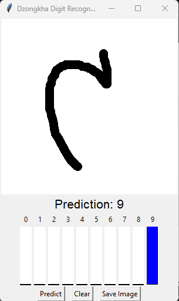

# handwritten Dzongkha digit detection using ML

This project uses a **ResNet18** model to classify handwritten digits (0-9) using the Dzongkha digit dataset.  
The model uses **data augmentation** and **transfer learning techniques** to improve generalization and performance.
Achieved Test Accuracy: 98.5%

A deep learning model that classifies handwritten Dzongkha digits (0-9) using PyTorch and ResNet-18 architecture.

## Features

- **Model Architecture**: Modified ResNet-18 adapted for grayscale images
- **Data Augmentation**: Random rotation, scaling, and cropping during training
- **Training Pipeline**: Includes validation and model checkpointing
- **Evaluation**: Provides classification report and confusion matrix
- **Interactive GUI**: Draw digits and get real-time predictions
- **Interactive Canvas**: Draw digits with your mouse
- **Real-time Prediction**: Get instant classification results
- **Confidence Visualization**: See prediction probabilities for all digits

## Requirements

- Python 3.7+
- PyTorch
- torchvision
- scikit-learn
- matplotlib
- seaborn
- pillow
- tqdm
- tkinter (usually included with Python)

## Dataset

- kaggle handwritten dzongkha digit dataset
- 

## Results

- After training the model, we obtained the following results on the test dataset:
- Test Accuracy: 98.5%

## checking on canvas the model

